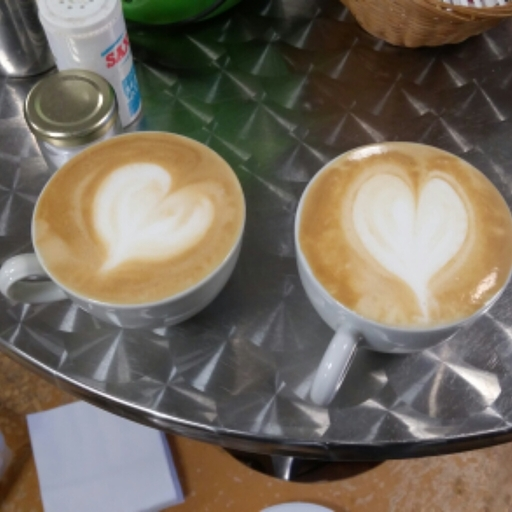
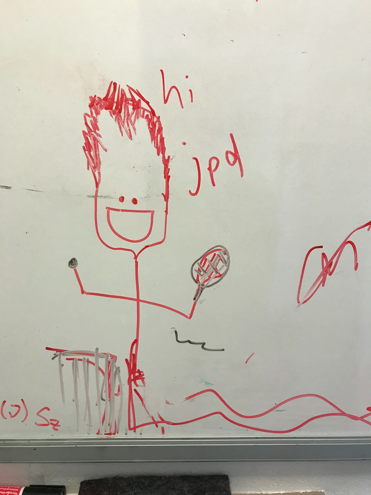

---                                                                                                                                                                                      
categories: news                                                                                                                                                                 
date:  2020-11-12 00:00:01 +0000                                                                                                                                                        
title: "Congratulations to James Darby for passing his PhD viva!!"

photo: "images/Jpd47TCM_mug_shot.jpg"

---            

The biggest congratulations to Dr. James "Big Jim" Darby for passing his PhD viva, everyone in the group is incredibly excited for him.  During his PhD, James worked on refining his skills in coffee art using the TCM Coffee Machine, until it was shut down in March of 2020.  After that, he turned his focus to writing up his PhD thesis, which he successfully defended on November 12th 2020.  Now, he will be working in the group of Gabor Csanyi, on machine learned atomistic potentials. Congratulations again Big Jim, hoping to celebrate in person in the future soon! 

<i>A sample of James' later work. (2019)</i>

<i>James, playing tennis, one of his favourite pasttimes, besides simulating tennis match outcomes. (2018)</i>

